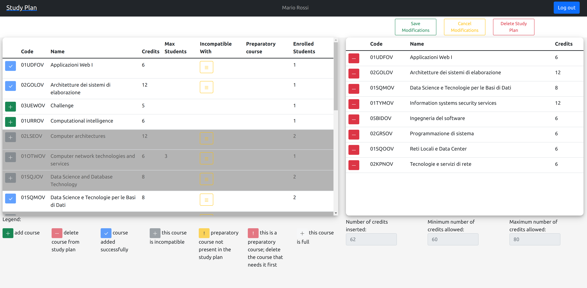

# Exam #1: "Study Plan"
## Student: s295149 ABED SERGIU 

## React Client Application Routes

- Route `/`: shows the full list of courses and, if logged in, the study plan of the logged in user
- Route `/login`: display the "LoginForm" component used for loging. No param used.

## API Server

- POST `/api/sessions`
  - request body stores the credential of the user for login (i.e. username and password)
  - response body content: a json object with the following properties : id, email, name, surname, tableName

- GET `/api/sessions/current`
  - request parameters: none
  - response body content: user information as described above

- DELETE `/api/sessions/current`
  - request parameters and request body content: no request parameters and no request bodu. For this action the cookie stored in the request header is enough
  - response body content: no content

- GET `/api/courses`
  - request parameters: none
  - response body content: an array of course objects having the following properties: code, name, credits, maxStudents, incompatibleWith, preparatoryCourse, enrolledStudents

- GET `/api/studyplan`
  - request parameters: none
  - response body content: an array of codes of the courses in the study plan

- PUT `/api/studyplan`
  - request parameters and request body content: no request parameters. The request body is a json object with the following properties: studyPlan, addedCourses, deletedCourses, type. "studyPlan" is an array of codes of the courses in the modified study plan, "addedCourses" is an array of codes of the courses that were added to the initial study plan and "deletedCourses"is an array of codes of the courses that were removed from the initial study plan. "type" is the study plan type, which is either "full-time" or "part-time". In the db an undefined study plan has as type "-".
  - response body content: none

- DELETE `/api/studyplan`
  - request parameters and request body content: no request parameters. The request body is an object with the following property: deletedCourses. "deletedCourses" is an array containing the codes of all the courses in the study plan to be deleted.
  - response body content: none

## Database Tables

- Table `users` - contains the following columns: id, email, name, surname, hash, salt, tableName, type
- Table `courses` - contains: code, name, credits, max_students, incompatible_with, preparatory_course, enrolled
- Table `BrunoGiallo`: - contains: code
- Table `JonSnow`: - contains: code
- Table `LucaVerdi`: - contains: code
- Table `MarioRossi`: - contains: code
- Table `PinoPalladino`: - contains: code
- Table `SteveJordan`: - contains: code

## Main React Components

- `Layout` (in `Layout.js`): gives the main structure of the front end GUI. It positions the navbar ("StudyPlanNavbar") at the top and in the remaining of the viewport either the full list of courses and (if logged in) the study plan list with some other buttons or the login form will be displayed. Also, at the bottom it will display an Alert with certain error or success messages.

- `LoginForm` (in `LoginForm.js`): is a form taking the email and password for performing the login.

- `Content` (in `Content.js`): structures all the information regarding courses and the study plan. It always displays the full list and if a user performed the login, it will show their study plan (if defined; otherwise it displays an option for choosing the type of study plan: full-time or part-time)

- `Legend` (in `Content.js`): describes what each button does or what it means when it is present next to a course.

- `StudyPlanTypeForm` (in `Content.js`): shows 2 buttons for choosing full-time or part-time when the user's study plan is not defined.

- `Content` (in `Content.js`): structures all the information regarding courses and the study plan. It always displays the full list and if a user performed the login, it will show their study plan (if defined; otherwise it displays an option for choosing the type of study plan: full-time or part-time)

- `CoursesTable` (in `CoursesTable.js`): defines the columns of each row and each row describes a course.

- `CourseRow` (in `CoursesRow.js`): it is a table row. It describes a course and if a user is logged in, the row will also show a button for adding the course to the study plan. If the constrains for the insertion into the study plan are not respected, a different disabled button will appear, which prevents from inserting this course in the study plan

- `NestedTable` (in `NestedTable.js`): serves for implementing the "expaned view" of a certain course. The user has to click on the expand button to see this table. The table may show the preparatory courses or the incompatible ones.

- `StudyPlanTable` (in `StudyPlan.js`): defines the columns of each row and each row describes a course in the study plan.

- `StudyPlanRow` (in `StudyPlan.js`): shows the information about a course and a button for deleting the course from the study plan. If a constrain is not satisfied, it will display a disabled button with exclamation mark.

## Screenshot

## Users Credentials

- bruno.giallo@domain.com, giallo
- mario.rossi@domain.com, mariorossi
- luca.verdi@domain.com, lucaverdi
- pino.palladino@domain.com, pinopalladino
- steve.jordan@domain.com, stevejordan
- jon.snow@domain.com, jonsnow
